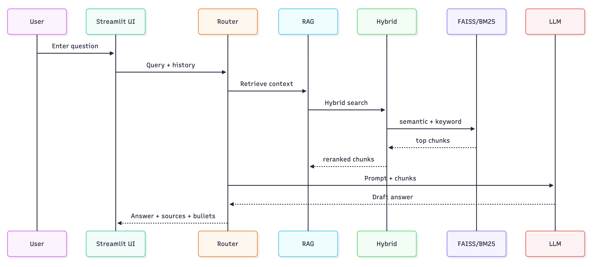

# PipelineIQ

**AI-powered Retrieval-Augmented Generation (RAG) over oil & gas PDFs** with a clean UI.  
PipelineIQ ingests your PDFs, chunks and embeds them with OpenAI, stores vectors in FAISS, and lets you chat with your corpus with sources + summaries.

---

## Features

- **PDF to chunks to OpenAI embeddings to FAISS vector store**
- **Conversational QA** (keeps your chat history in-session)
- **Cited answers + 3-bullet summaries**
- **One-click “Re-Ingest PDFs”** button in the UI
- Clear **project structure**: `rag_core/` holds ingestion & QA logic, UI stays thin

---

## Architecture (high level)




1. **Ingestion (`rag_core/ingest.py`)**
   - Read `data/metadata.json`
   - Extract text from `data/raw_documents/*.pdf`
   - Chunk with `RecursiveCharacterTextSplitter`
   - Embed with **OpenAIEmbeddings**
   - Store in **FAISS** (`vectorstore/`)

2. **Querying (`rag_core/qa.py`)**
   - Load FAISS, retrieve top-k chunks
   - Run **LLM QA** chain to generate an answer with sources
   - Produce a **3-bullet summary**

3. **UI (`demo_app.py`)**
   - Streamlit app with ADNOC branding
   - Ask questions, see history, re-ingest PDFs from sidebar

---

## Repository Layout

```
PipelineIQ/
├── data/
│   ├── raw_documents/          
│   └── metadata.json   
├── notebooks/
│   └── 1_ingest.ipynb          
├── rag_core/
│   ├── __init__.py
│   ├── ingest.py             
│   └── qa.py                    
├── vectorstore/
├── .streamlit/
│   └── config.toml             
├── .env.example                
├── demo_app.py                 
├── requirements.txt
└── README.md
```

---

## Prerequisites

- Python **3.10+**
- An **OpenAI API key**

---

## Setup

### 1) Create & activate a virtual environment

```bash
python -m venv .venv
source .venv/bin/activate          
```

### 2) Install dependencies

```bash
pip install -r requirements.txt
```

### 3) Configure environment

```bash
cp .env.example .env
# open .env and set:
# OPENAI_API_KEY=sk-...
```

### 4) Add your PDFs

- Put your files in: `data/raw_documents/`
- List them in `data/metadata.json`, e.g.:

```json
[
  { "title": "Oil & Gas Production Handbook", "filename": "oil_gas_handbook.pdf" },
  { "title": "Blowout Preventers", "filename": "Blowout-Preventers-1.pdf" }
]
```

### 5) Build the vector store (pick one)

**A) From the Streamlit UI (easiest)**

```bash
streamlit run demo_app.py
```

Open the app → click **Re-Ingest PDFs** in the sidebar.

**B) From CLI**

```bash
python -m rag_core.ingest
```

**C) From the notebook**

```bash
jupyter lab notebooks/1_ingest.ipynb
```

### 6) Run the app

```bash
streamlit run demo_app.py
```

It will start on http://localhost:8501.

---

## Usage

1. Type a question in the input box.
2. The app retrieves the most similar chunks from FAISS.
3. The LLM answers and returns:
   - **Answer**
   - **3-bullet summary**
   - **Sources** (PDF + page)
4. Your past Q&A stays on the page (session memory).
5. Click **Clear chat history** to wipe the session.

---

## Troubleshooting

### `ModuleNotFoundError: No module named 'tiktoken'`

```bash
pip install tiktoken
```

### `ValidationError: Did not find openai_api_key`

Ensure `.env` exists and `OPENAI_API_KEY` is set, then:

```bash
source .venv/bin/activate
export OPENAI_API_KEY=sk-...   
```

### `DependencyError: PyCryptodome is required for AES algorithm`

```bash
pip install pycryptodome
```

### FAISS “dangerous deserialization” error

When loading your **own** FAISS store:

```python
FAISS.load_local(path, embeddings, allow_dangerous_deserialization=True)
```

(Do **not** enable this if the index comes from an untrusted source.)

---

## Roadmap (ideas)

- Swap FAISS → **Chroma** or **PGVector**
- Add **Rerankers** (e.g., Cohere / Cross-encoders)
- **Multi-modal** support (images, tables)
- **Agents / Tools** (diagnostics, troubleshooting steps)
- **Access control & user auth**
- **Docker** for easy deployment

---

## License

Proprietary / Internal (adjust to your needs).
